# 3DLineRenderer
## Project Overview   
#### RoadMap:

:heavy_check_mark: Learn how to make plane,cube,circle,sphere,capsule 3D mesh renderer  
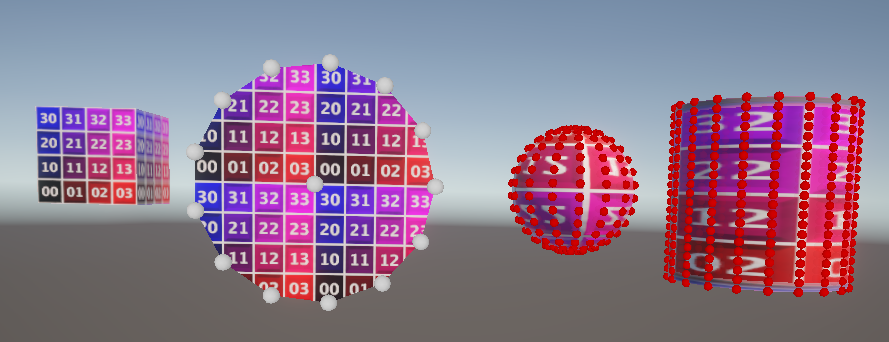 

##### :heavy_check_mark: Make basic 3D line renderer without connections in between  

##### :heavy_check_mark: Make pipes connections using bezier curve 🤔 
Before issue =======================> After solution: 
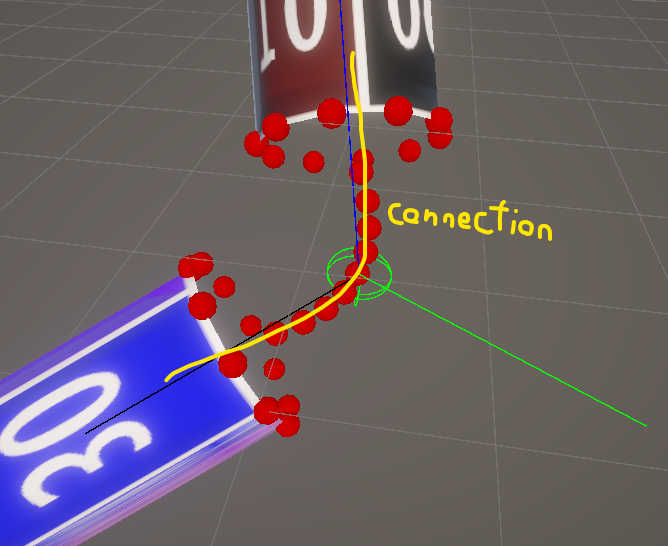
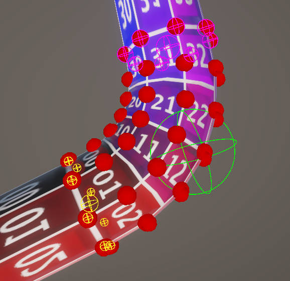  

##### :heavy_check_mark: Repair pipes UV 
Before issue =======================> After solution: 
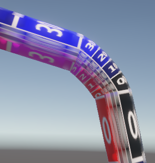
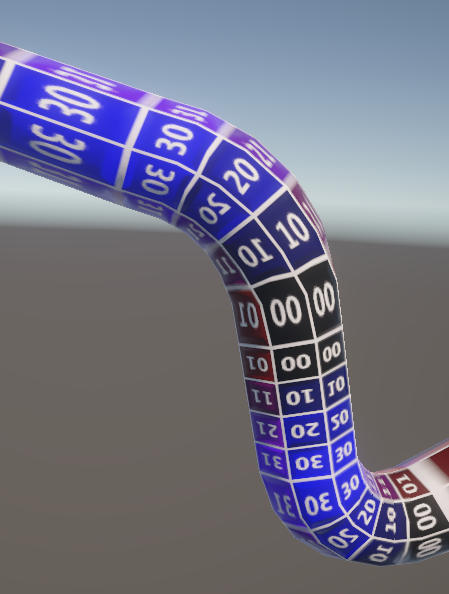  

##### :heavy_check_mark: Make auto line spliting if single line is too big to ensure that uv is always perfecto✨ 
Before issue =======================> After solution: 
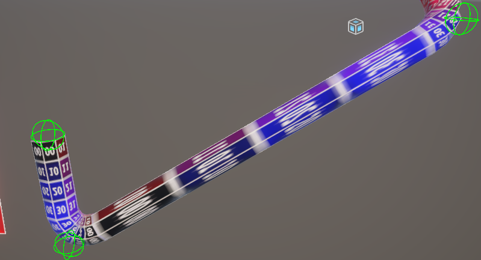
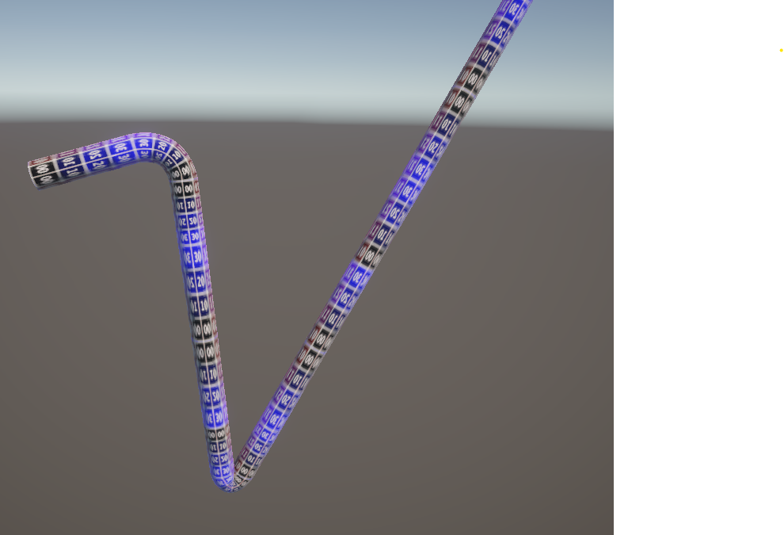  
##### :heavy_check_mark: Make caps on the end 
Before issue =======================> After solution: 
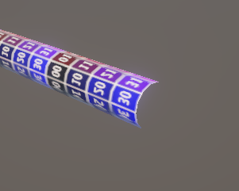 
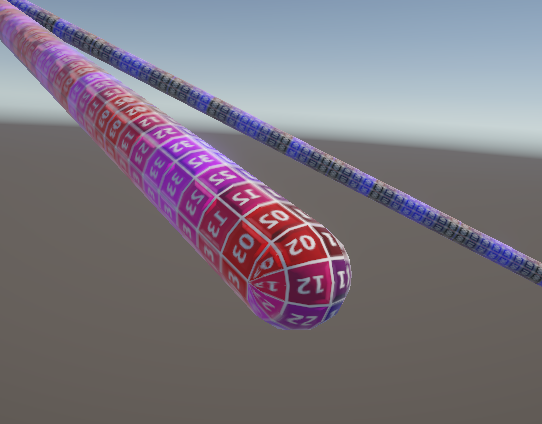 

##### :heavy_check_mark:  Fix some bugs 
Before issue =======================> After solution: 
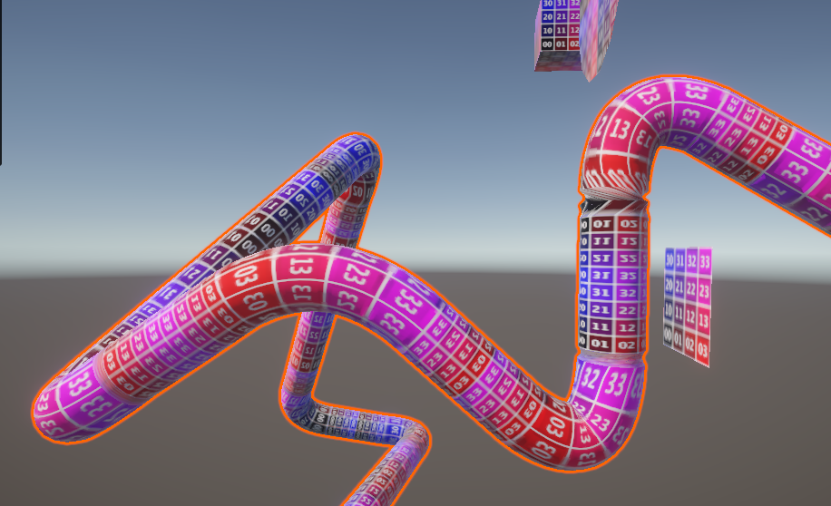 
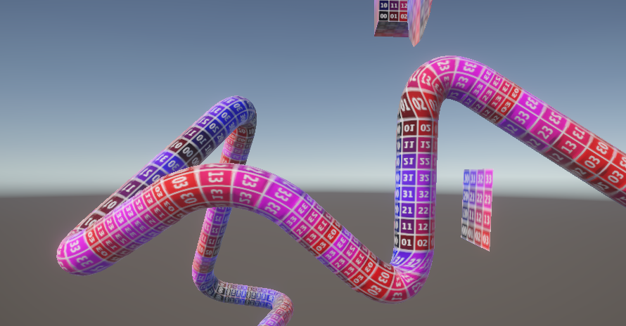 
##### :heavy_check_mark:  Editor 
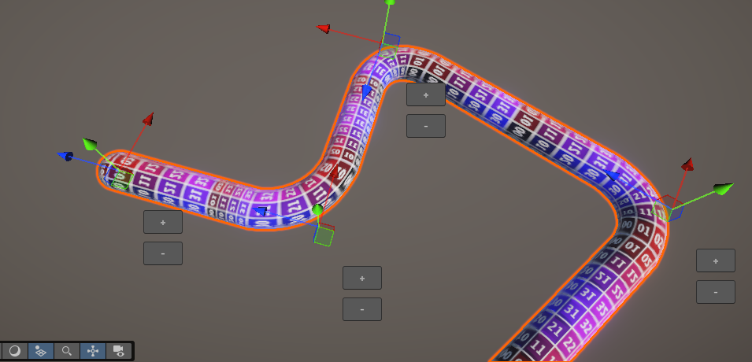   
