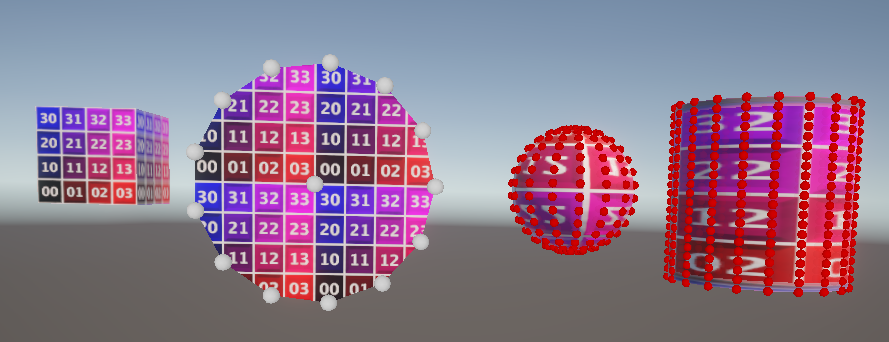

# 3DLineRenderer (WIP)
## Project Overview   
#### RoadMap:
:heavy_check_mark: Learn how to make plane,cube,circle,sphere,capsule 3D mesh renderer  
 
:heavy_check_mark: Make basic 3D line renderer without connections in between  
:heavy_check_mark: Make pipes connections using bezier curve and other fancy stuff 🤔 
Before issue =======================> After solution: 

  
:heavy_check_mark: Repair pipes UV 
Before issue =======================> After solution: 

  
- [ ] Make auto line spliting if single line is too big to ensure that uv is always perfecto✨ 
 
- [ ] First visualization demo 
- [ ] Optimalisation with using Unity Jobs and Advanced Mesh API with Multi-Stream Approach, <a href="https://catlikecoding.com/unity/tutorials/procedural-meshes/creating-a-mesh/">great blog about that</a> 
- [ ] Release this as free simple 3D Line renderer asset avaible for everyone  
